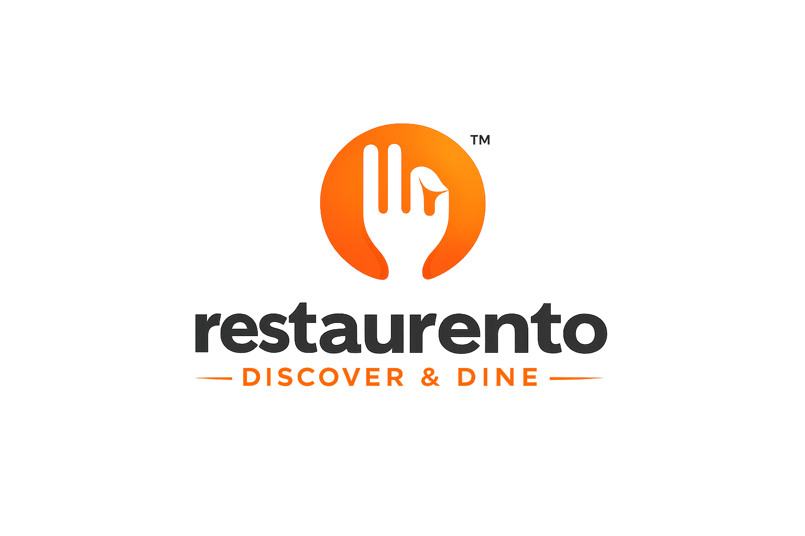

  

  <strong>A Full-Stack, Production-Grade Restaurant Booking & Management Platform</strong>

  
  
  
  
  
  

 

## 📖 Overview

**Restaurento** is a comprehensive, scalable restaurant booking and management ecosystem designed for high concurrency and performance. It features a beautifully crafted, highly responsive UI, robust business logic, secure payment processing, and real-time operational syncing between diners and restaurant partners.

---

## ✨ Key Features & Modules

### 👤 User Application (Diners)
- **Seamless Authentication:** Secure JWT-based login, Email OTP verification, and Google Single Sign-On (SSO).
- **Discovery & Reservations:** Explore top-rated restaurants, view real-time table availability, and secure bookings.
- **Digital Wallet & Offers:** Integrated digital wallet for seamless refunds and a dedicated promotional coupon system.
- **Secure Payments:** Frictionless checkout experience powered by Razorpay.
- **Engagement:** Leave verified reviews and curate a personal wishlist of favorite dining spots.
- **Real-Time Tracking:** Receive instant push notifications and booking status updates.

### 🏪 Partner Portal (Restaurants)
- **Profile & Schedule Management:** Granular control over restaurant details, operating hours, and dynamic table inventory.
- **Live Booking Dashboard:** Accept, reject, and manage incoming reservations in real-time.
- **Marketing Tools:** Create and deploy localized restaurant offers and promotions to attract diners.
- **Analytics:** Visual insights into daily/weekly reservations, revenue tracking, and customer review management.

### 🛡️ Administrative Console
- **Platform Oversight:** Complete CRUD management of users, restaurant partners, and administrative roles.
- **Financial Controls:** Management of platform-wide discount coupons, refunds, and global wallet transactions.
- **Dynamic Content:** Real-time management of platform banners and promotional content.
- **Reporting:** Exportable business analytics, sales dashboards, and revenue tracking (PDF/Excel).

---

## 🏗️ Technical Architecture & Business Logic

### Core Business Logic
- **Segregated Revenue:** Strict financial logic separating platform-funded coupons from restaurant-specific offers.
- **Booking State Machine:** Complex, fault-tolerant state handling for the booking lifecycle (Pending → Confirmed → Completed/Cancelled).
- **Wallet Infrastructure:** Immutable ledger tracking for user wallet transactions and automated refund handling.

### Real-Time Infrastructure (Socket.IO & Redis)
- **Low-Latency Updates:** Provides immediate, bi-directional synchronization between the user frontend and restaurant dashboard.
- **Event-Driven Communication:** Instant table lock/unlock updates and live order state modifications.
- **Caching Layer:** Redis integration to cache high-frequency read operations, significantly minimizing MongoDB load and improving response times.

### Security Standards
- **Data Validation:** Strict endpoint request and UI form validation using **Zod** across both client and server boundaries.
- **API Protection:** Implemented Express Rate Limiting to mitigate DDoS and brute-force attacks.
- **Auth Hardening:** HTTP-only cookies, robust JWT validation, and environment variable schema validation to prevent misconfigurations.

### Code Quality & Engineering
- **Layered Backend Design:** Enforced separation of concerns (Controllers → Services → Models) for highly maintainable and testable server code.
- **Hybrid State Management:** Combined **React Query** for async server-state caching (deduplication, background refetching) with **Redux Toolkit** for complex synchronous UI state.
- **Containerization:** Fully containerized development environments using Docker & Docker Compose.

---

## 🛠️ Technology Stack

| Domain | Technologies |
| :--- | :--- |
| **Frontend** | React 19, Vite, Tailwind CSS, Framer Motion, Recharts, React Hook Form |
| **Backend** | Node.js, Express.js |
| **Database** | MongoDB (Mongoose ORM) |
| **Caching & Real-Time** | Redis, Socket.IO |
| **Authentication** | JWT, Google Auth Library, bcryptjs |
| **Payments** | Razorpay |
| **Storage & Media** | Cloudinary, Multer |
| **Tooling & DX** | ESLint, Docker, Zod |

---

  <i>Developed with ❤️ for scalable architecture and premium user experiences.</i>

